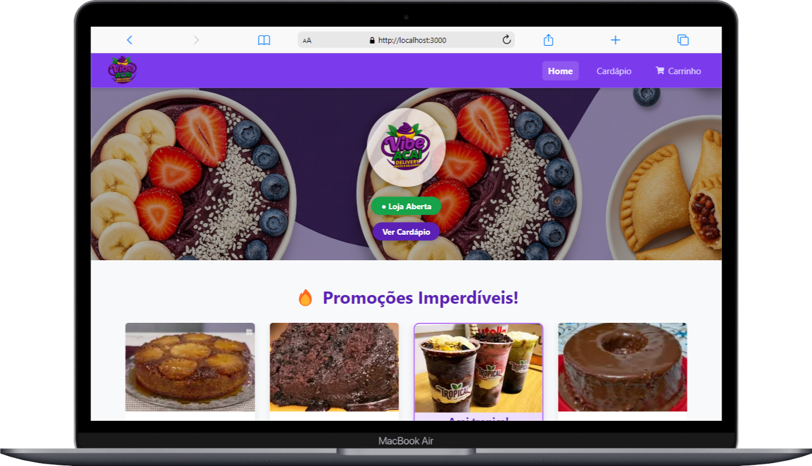
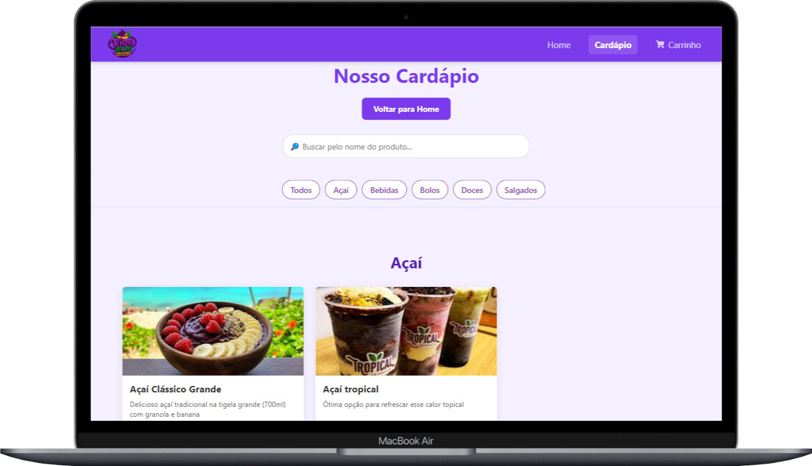
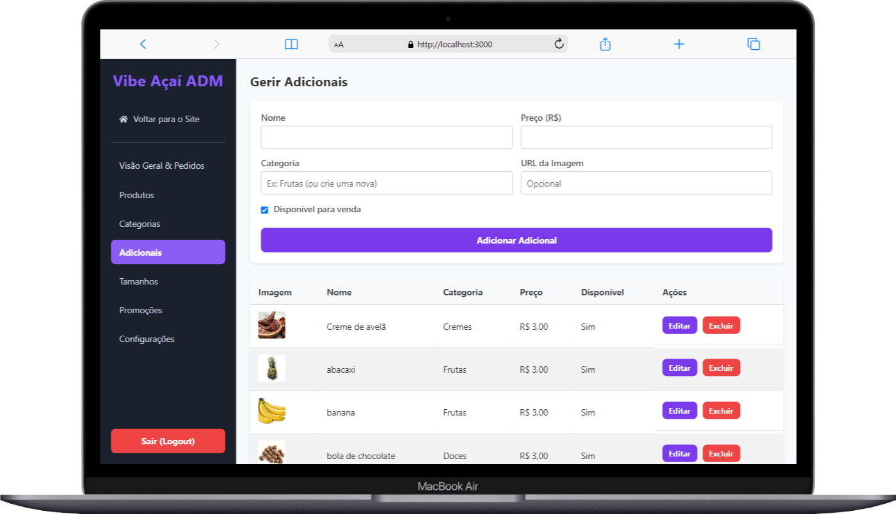

# 🍧 Vibe Açaí - Sistema de Delivery Completo


Um sistema de e-commerce completo e em tempo real, desenvolvido para lojas de açaí e similares. O projeto inclui uma vitrine moderna para os clientes e um painel administrativo poderoso para gestão de produtos, pedidos e configurações da loja.

---

## 📜 Índice

- [Visão Geral](#-visão-geral)
- [📸 Screenshots](#-screenshots)
- [✨ Funcionalidades](#-funcionalidades)
  - [Cliente (Vitrine)](#-cliente-vitrine)
  - [Administrador (Painel de Gestão)](#-administrador-painel-de-gestão)
- [🛠️ Tecnologias Utilizadas](#️-tecnologias-utilizadas)
- [🚀 Começando](#-começando)
  - [Pré-requisitos](#pré-requisitos)
  - [Configuração do Firebase](#configuração-do-firebase)
  - [Instalação Local](#instalação-local)
- [📂 Estrutura do Projeto](#-estrutura-do-projeto)
- [📄 Licença](#-licença)

---

## 🖼️ Visão Geral

O **Vibe Açaí** foi criado para oferecer uma experiência de compra fluida e agradável para os clientes e, ao mesmo tempo, dar ao dono da loja controle total sobre o seu negócio. A integração com o Firebase garante que os pedidos cheguem em tempo real, as informações estejam sempre atualizadas e a gestão seja feita de forma segura.

---

### 📸 Screenshots

| Página Inicial | Cardápio com Filtros | Painel do Administrador |
| :---: | :---: | :---: |
|  |  |  |

---

## ✨ Funcionalidades

### 🛍️ Cliente (Vitrine)

- **Vitrine Dinâmica:** Página inicial com banner, promoções e produtos em destaque.
- **Cardápio Inteligente:**
    - Filtro de produtos por categoria.
    - Busca de produtos por nome.
- **Personalização de Açaí:** Modal interativo para o cliente montar o açaí, escolhendo tamanho e adicionais.
- **Carrinho de Compras:** Adição e gestão de itens com cálculo de subtotal.
- **Status da Loja:** O cliente é informado se a loja está aberta ou fechada e vê o horário de funcionamento.
- **Checkout Simplificado:** Página para inserir informações de entrega e finalizar o pedido.
- **Design Responsivo:** Interface adaptada para computadores, tablets e telemóveis.

### ⚙️ Administrador (Painel de Gestão)

- **Login Seguro:** Autenticação para acesso exclusivo ao painel.
- **Dashboard em Tempo Real:**
    - Visualização de novos pedidos que chegam instantaneamente.
    - **Notificações sonoras e visuais** (ícone de sino com contador) para cada novo pedido.
    - Gestão de status dos pedidos (Pendente, Em Preparo, Saiu para Entrega, Finalizado).
- **Gestão de Conteúdo (CRUD completo):**
    - **Produtos:** Crie, edite e remova produtos, definindo nome, preço, categoria, imagem, etc.
    - **Categorias:** Organize seus produtos em categorias.
    - **Adicionais:** Gira a lista de toppings disponíveis para os açaís.
    - **Tamanhos:** Defina os tamanhos e preços dos copos de açaí.
    - **Promoções:** Crie promoções de desconto para produtos específicos.
- **Configurações da Loja:**
    - Alterar logo e banner da loja.
    - Definir a taxa de entrega.
    - **Abrir e Fechar a loja** com um clique.
    - Definir o texto com os horários de funcionamento.

---

## 🛠️ Tecnologias Utilizadas

- **Frontend:**
    - [React.js](https://reactjs.org/)
    - [React Router](https://reactrouter.com/)
    - [Styled Components](https://styled-components.com/) para estilização.
- **Backend & Banco de Dados (BaaS):**
    - [Firebase](https://firebase.google.com/)
        - **Firestore:** Banco de dados NoSQL em tempo real.
        - **Authentication:** Para login de administradores.
        - **Storage:** Para upload de imagens de produtos e da loja.
- **UI/UX & Outros:**
    - [React Hot Toast](https://react-hot-toast.com/) para notificações.
    - [Swiper.js](https://swiperjs.com/) para carrosséis.
    - [React Icons](https://react-icons.github.io/react-icons/) para ícones.

---

## 🚀 Começando

Siga estas instruções para obter uma cópia do projeto e executá-la na sua máquina local para desenvolvimento e testes.

### Pré-requisitos

- [Node.js](https://nodejs.org/en/) (versão 16 ou superior)
- `npm` ou `yarn`

### Configuração do Firebase

Este projeto depende de uma configuração do Firebase para funcionar.

1.  **Crie um projeto no Firebase:**
    - Vá para o [Console do Firebase](https://console.firebase.google.com/).
    - Clique em "Adicionar projeto" e siga os passos.

2.  **Crie uma Aplicação Web:**
    - Dentro do seu projeto, clique no ícone da Web (`</>`) para adicionar uma nova aplicação web.
    - Dê um nome à aplicação e copie o objeto `firebaseConfig`.

3.  **Configure os Serviços:**
    - **Firestore Database:** No menu lateral, vá para `Firestore Database` e clique em "Criar banco de dados". Comece no **modo de teste** para facilitar o desenvolvimento inicial.
    - **Authentication:** No menu `Authentication`, vá para a aba `Sign-in method` e ative o provedor **"E-mail/senha"**.
    - **Storage:** No menu `Storage`, clique em "Começar" e siga as instruções para criar um bucket de armazenamento.

### Instalação Local

1.  **Clone o repositório:**
    ```bash
    git clone [https://github.com/seu-usuario/vibeacai.git](https://github.com/seu-usuario/vibeacai.git)
    ```

2.  **Navegue para a pasta do projeto:**
    ```bash
    cd vibeacai
    ```

3.  **Instale as dependências:**
    ```bash
    npm install
    # ou
    yarn install
    ```

4.  **Configure as variáveis de ambiente:**
    - Navegue até o ficheiro `src/services/firebaseConfig.js`.
    - Substitua o objeto de configuração de exemplo pelo seu objeto `firebaseConfig` que você copiou do console do Firebase.

    ```javascript
    // src/services/firebaseConfig.js

    const firebaseConfig = {
      apiKey: "SUA_API_KEY",
      authDomain: "SEU_AUTH_DOMAIN",
      projectId: "SEU_PROJECT_ID",
      storageBucket: "SEU_STORAGE_BUCKET",
      messagingSenderId: "SEU_MESSAGING_SENDER_ID",
      appId: "SUA_APP_ID"
    };
    ```

5.  **Execute a aplicação:**
    ```bash
    npm start
    # ou
    yarn start
    ```

A aplicação deverá estar a ser executada em `http://localhost:3000`.

---

## 📂 Estrutura do Projeto

A estrutura de ficheiros foi organizada para ser escalável e de fácil manutenção:

vibeacai/
├── public/              # Ficheiros estáticos e HTML base
└── src/
├── assets/          # Imagens, fontes, etc.
├── components/      # Componentes React reutilizáveis (Button, Modal, Card)
├── contexts/        # Contextos da aplicação (Auth, Cart, StoreSettings)
├── pages/           # Componentes de página (HomePage, MenuPage, Admin/Dashboard)
├── routes/          # Configuração das rotas da aplicação
├── services/        # Configuração de serviços externos (firebaseConfig.js)
├── styles/          # Estilos globais
└── App.js           # Componente principal que renderiza as rotas


---

## 📄 Licença

Este projeto está sob a licença MIT. Veja o ficheiro [LICENSE](LICENSE) para mais detalhes.

---